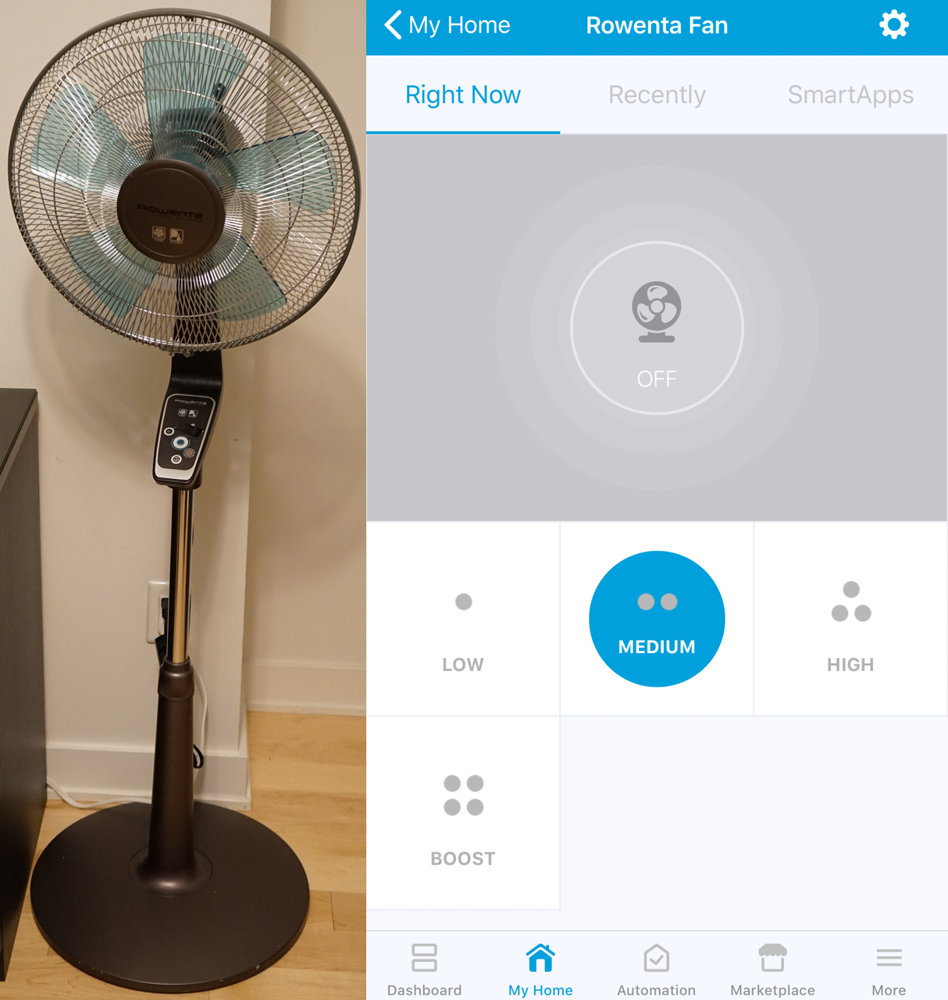

### z-rowenta

This project is about turing a boring pedestal fan (in this case a Rowenta VU5551) into a smart Z-Wave enabled fan. The
main component is a Z-Uno. The Z-Uno is effectively an Arduino with a Z-Wave chip. And as is tradition, it uses the
Arduino IDE to [program it](https://z-uno.z-wave.me/getting-started/). The next component in the project is a Samsung's
[SmartThings](https://www.smartthings.com/) [hub](https://shop.smartthings.com/products/samsung-smartthings-hub).
[SmartThings](http://docs.smartthings.com/en/latest/getting-started/overview.html) allows you to write
[custom handlers](http://docs.smartthings.com/en/latest/device-type-developers-guide/index.html) for any device on a
Z-Wave (or Zigbee) network which is perfect for this project.

#### Hardware

The hardware was the hardest part of this project because it involves painstaking process of mapping out an existing
circuit trace by trace and component by component along with a multimeter. Once the circuit is mapped out it's easy to
integrate into it. You can [read more about the hardware here](hardware).

#### Z-Uno Code

To compile and upload the code you'll need to complete the [Getting Started](https://z-uno.z-wave.me/getting-started/)
guide for the Z-Uno. Once you've compiled and uploaded the code to your Z-Uno you can include it into your SmartThings
Z-Wave network. The code for the Z-Uno is in [z-rowenta.ino](z-rowenta/z-rowenta.ino).

#### SmartThings Device Handler

After you've included the Z-Uno into your network you can sign into the
[SmartThings website](https://graph.api.smartthings.com) and add this repo (samuelkadolph/z-rowenta) to your device
handlers and update from the repo to get the z-rowenta device handler. And then you need to edit the
`Z-Wave Device Multichannel` device and update the `Type` to `Rowenta Fan`. The code for device handler is in
[rowenta-fan.groovy](devicetypes/z-rowenta/rowenta-fan.src/rowenta-fan.groovy).
