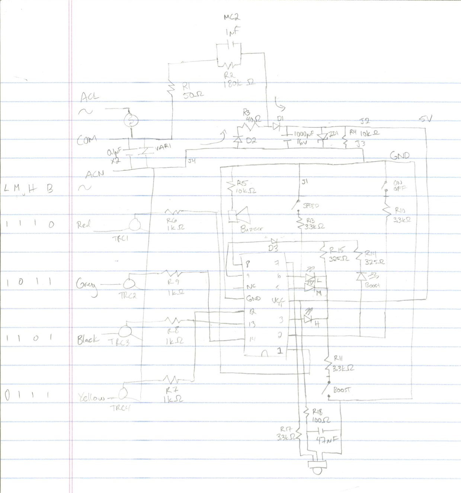
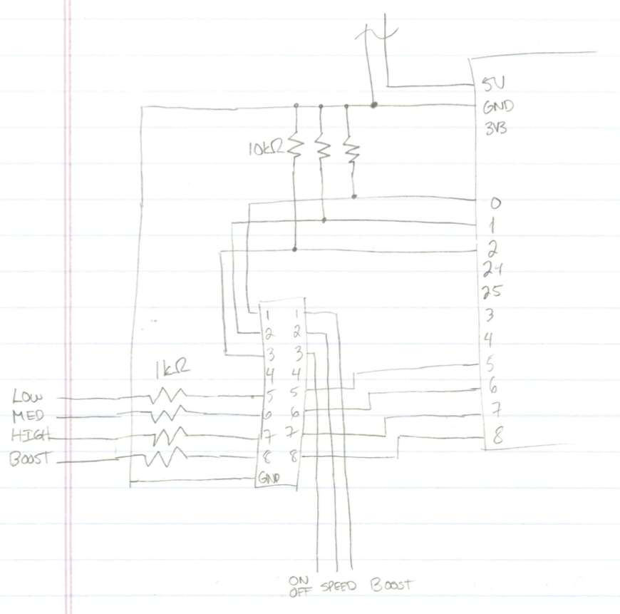
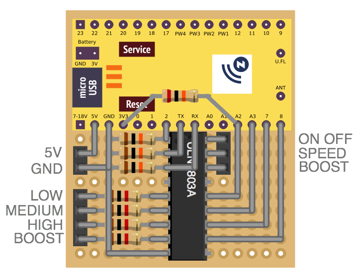

## Mapping the circuit

The first step in adding the Z-Uno to the fan is to map out the existing circuit. Some paper, a pencil, and a multimeter
later produces this diagram.

The circuit isn't very complex. The top part is a
[capacitive dropper power supply](https://en.wikipedia.org/wiki/Capacitive_power_supply) that provides 5V. My first step
was to bump up the current capability of this circuit so I replaced the 1µF capacitor (`MC2`) with a 3.3µF one.

On the lower left section is the 120V section of the circuit that uses transistors to switch different windings on and
off to achieve the 4 different speeds of this fan.

The centre of the sketch is the microcontroller. On pin 8 there's a small buzzer hooked up to make the beeps. Pin 9
is the common for the 4 speed LEDs. Pins 12, 13, 14, and 1 are hooked up to the transistors on the left. Pin 2 turns the
boost LED on and detects when you press the On/Off button. Pin 3 handles the high LED and boost button. Pin 4 is for
power. Pin 5 only does the medium speed LED. Pin 6 does the low speed LED and speed button. Pin 7 is hooked up to the IR
receiver for remote control.

## Reading the status

When the fan is off pins 12, 13, 14, and 1 are all pulled high and when the fan is on one of the pins will be pulled low
depending on which speed is selected. Unfortunately the Z-Uno's input pins are limited to 3.3V. If you exceed this limit
it could damage it. To be able to read the state we can set the pin to `INPUT_PULLUP` which means by default the pin
will pulled to 3.3V with a 15kΩ resistor. Add in a transistor with the collector connected to the Z-Uno, the base
connected to the fan, and the emitter connected to ground. This will pull the Z-Uno pin low when the fan pin output is
high (when that speed is off). Now do that 3 more times and we can read all 4 pins with the Z-Uno.

## Simulating the buttons

## Designing the circuit

Below is a sketch of the circuit to glue the Z-Uno to the fan. Instead of using 7 separate transistors, it's better to
use a ULN2803A Darlington Transistor Array. This has the advantage of only needing 1 ground connection as well as
reducing part count. To limit current from the fan microcontroller's output, each pin gets a 1kΩ resistor. And to
prevent the button outputs from floating, those 3 pins each get a 10kΩ resistor to pull them low.

After that circuit was tested on a breadboard, [Fritzing](http://fritzing.org/) was used to layout a perfboard circuit
for the permanent circuit. This layout requires no jumper wires as non of the traces overlap. A bodge resistor is
required as pin 5 on the Z-Uno has a bug with being in `INPUT_PULLUP` mode.

## Making the circuit
